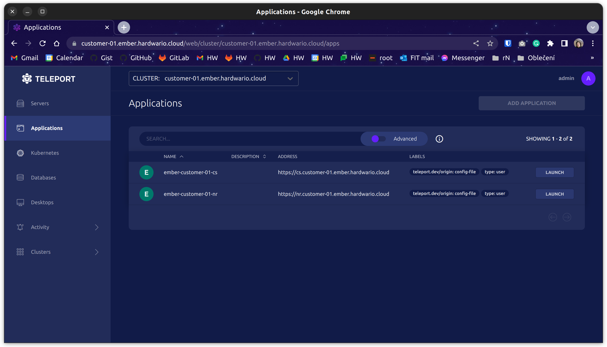

# Remote login

To create your first Teleport account, you will receive a link from us. We have enabled two-factor authentication so you will need hardware key ([YubiKey](https://yubikey.me/)) or some kind of authenticator app (Google Authenticator - [iOS](https://apps.apple.com/us/app/google-authenticator/id388497605) | [Android](https://play.google.com/store/apps/details?id=com.google.android.apps.authenticator2&hl=cs&gl=US)).

1. Open link:

  

1. You have a predefined username `admin` for the first account so just fill in a password.

  

1. Add your hardware key or use your authenticator app and fill digit code from the app:

  

1. You should have a success screen as follow:

  

1. If you navigate to `Dashboard` > `Applications`. You should see ChirpStack and Node-RED as follow:

  

  You can enter applications via Teleport dashboard or URL that you can see in the applications.
